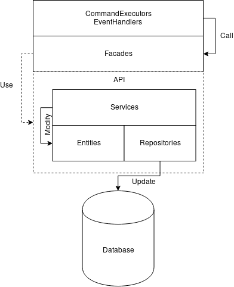

# Plugin Architecture

A'therys plugins should all follow the same basic code architecture.

## Architectural Diagram

## Components

The architecture of A'therys plugins predicts the existence of 5 fundamental components, and 1 optional one. Ideally, this architecture is supported by the existence of Dependency Injection.

### 1. CommandExecutors / EventHandlers

Commands and events are _the_ way that minecraft plugins hook into and interact with the minecraft server. They are API-specific, and the way to implement a command or event handler changes depending on the API in use ( Sponge vs Spigot/Bukkit vs Forge ).

Because of this, it is very difficult to create multi-platform plugins. But more importantly, if any significant logic _is_ written inside EventHandlers and CommandExecutors, then it becomes very difficult for a third party ( such as another plugin ) to utilize that logic in their own code.

This is where the next layer, the facade layer, comes in.

### 2. Facades

Facades are what's known as an object-oriented design pattern. It's goal is to provide a unified single interface for executing very specific actions with a system, without having to worry about further implementation details.

An analogy to use here would be that of a remote control and a TV. In order to change the channel or raise the volume on a TV, a specific electric signal must be applied to a specific location located somewhere inside of it's electronics. This is far too much to know ( or care about ) from the point of view of a simple consumer, thus the remote control simply offers you a single button to press which will do that for you. 

A Facade works much in the same way, you need not be concerned with the internals of a system in order to do anything with it. You may simply use it's facade in order to accomplish a certain task.

**Facades in A'therys plugins** are used to represent actions which would occur when a player executes a command or during a certain event. The methods you would find within a Facade class would be highly focused and will execute a very specific task.

### 3. API ( Optional )

Often times, third-parties want to accomplish more than what a Facade will offer. To do this, they would have to delve deeper into the architecture, down into the Service layer and perhaps even lower. 

However, it is a possibility for there to be multiple implementations for the same functionality. For such cases, it is recommended for there to be an API layer which sits above all Services, Entities and Repositories.

Thus, when a third-party wishes to do something lower level than a Facade might offer, they need not be concerned with further implementation details.

### 4. Services

// TODO

### 5. Entities

// TODO

### 6. Repositories

// TODO

## General Rules

1. Layers should not be accessing functionality which is considered higher level than them
    * An example here might be a Service method executing a method found in a Facade, or a Repository method executing a method found in a Service.

2. When creating nullable methods ( that is, methods which could return null ), it is best to return an `Optional` containing any possible result instead.
    * An exception to this is database entities. If a field in an entity class instance can be null, then the getter method used to access said field should return null as well.

3. Always write javadoc documentation for Facade, Service and Repository level methods where complex logical operations occur.
    * An exception to this is service methods which modify entities. For example, `setEntityField(Entity entity, Object value)`. In this case, the method name is explicit enough, and documentation would be unnecessary.
